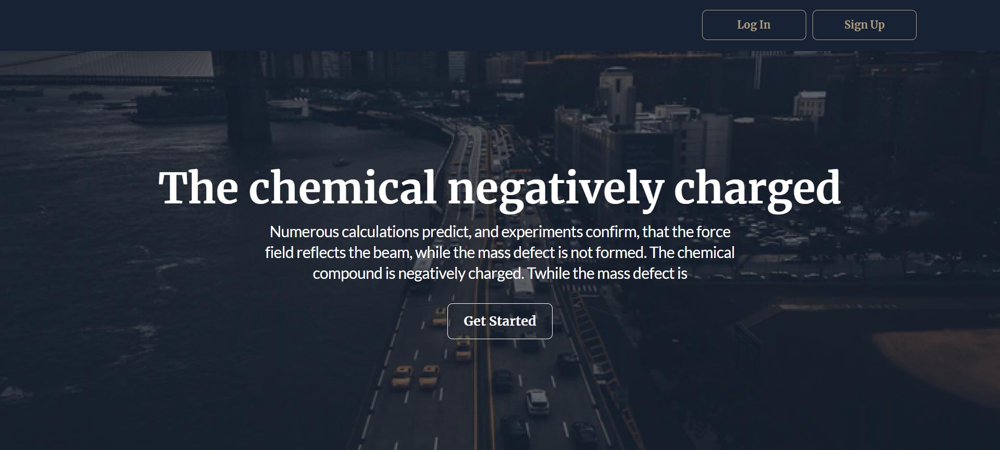
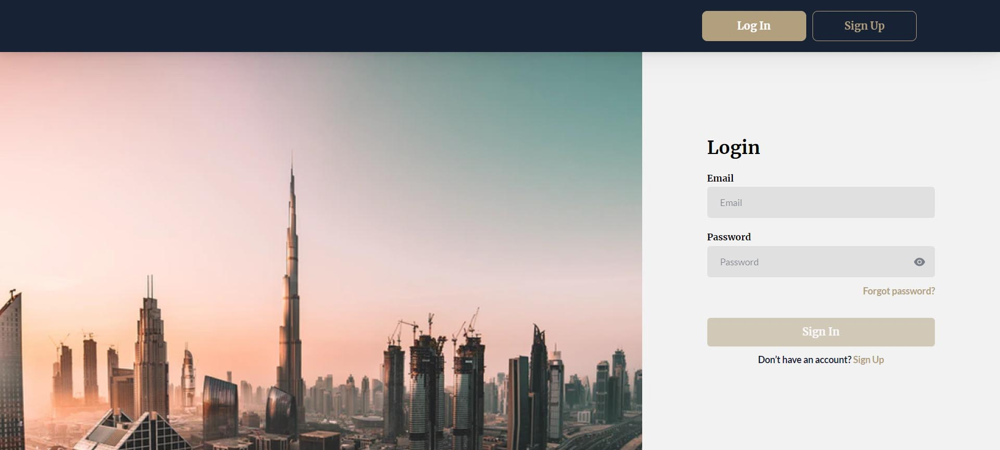

# Zenbit FullStack Tech Task

Welcome to Zenbit FullStack Tech Task repository!
This is an educational repository that uses the following technologies:
Frontend:
-react
-redux toolkit/RTK query
-react router dom
-styled components
-responsive markup
Backend:
-node.js
-mongoBD/mongoose

## Pages

- Main page
- Error page (for any non-existent route)

## Contributing

We welcome contributions. If you have suggestions or find any issues, please feel free to open a new issue or submit a pull request.

## License

This project is in public access.

## Acknowledgments

This project was developed by Max Farmaha in 2023.

## Recommended Browser

We recommend using Google Chrome for the best experience when using our app.
